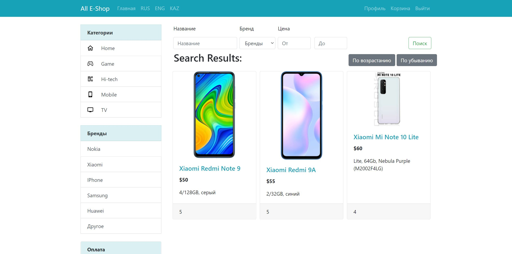

# Mobile-E-Shop
<h2>My semester task - internet shop with Spring Boot</h2>

**This site has**

✅ Registration and Authorization

✅ Updating your profile

✅ Uploading pictures

✅ Admin panel

✅ Language switching (3 languages)

✅ Product sorting and searching

✅ Sorting products by ratings

✅ Certain product's gallery

✅ Comments

✅ Basket

